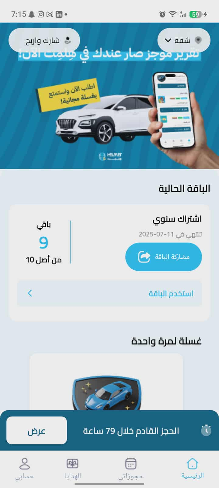
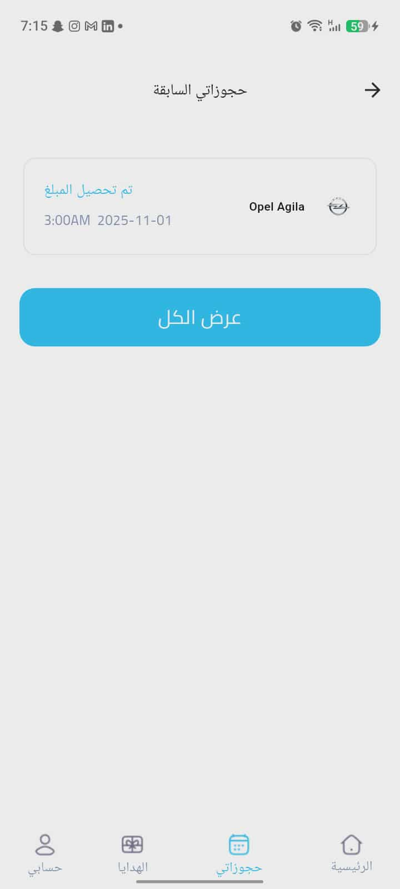
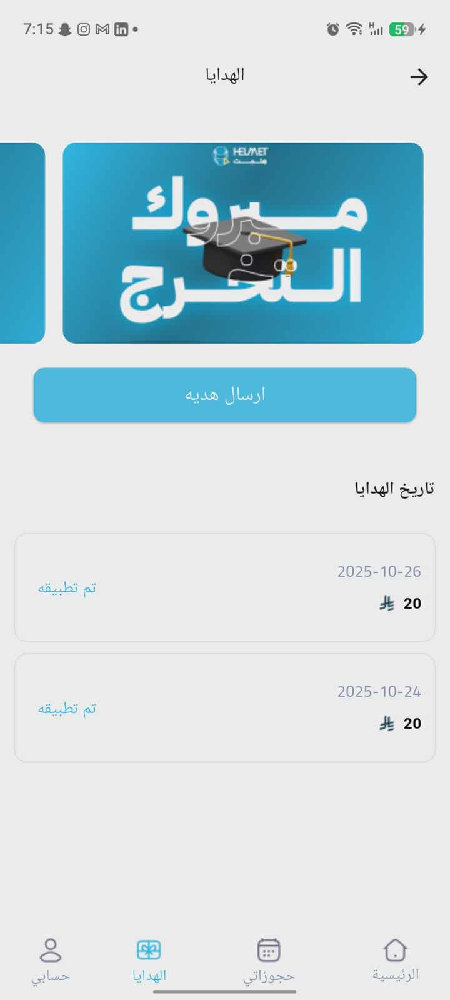
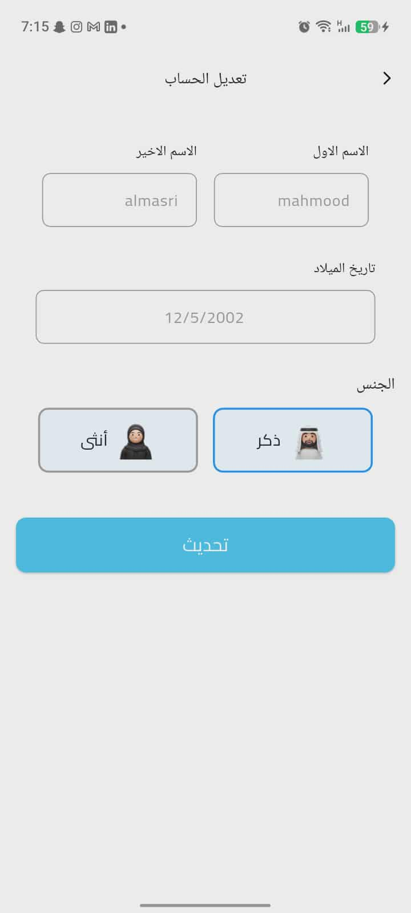
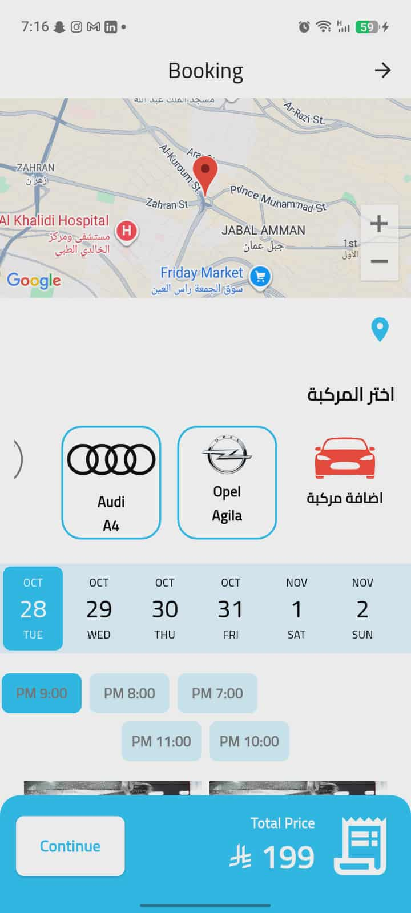
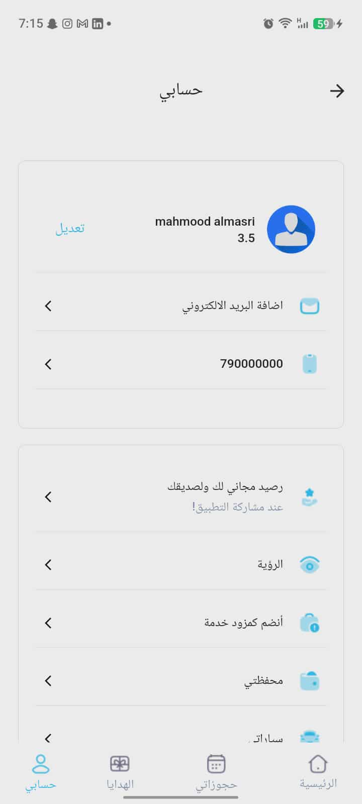
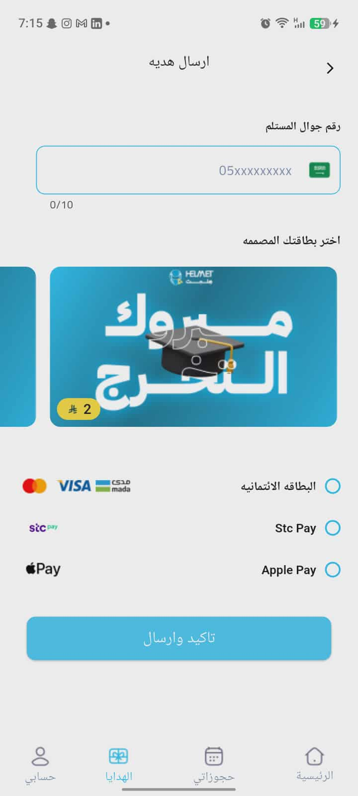
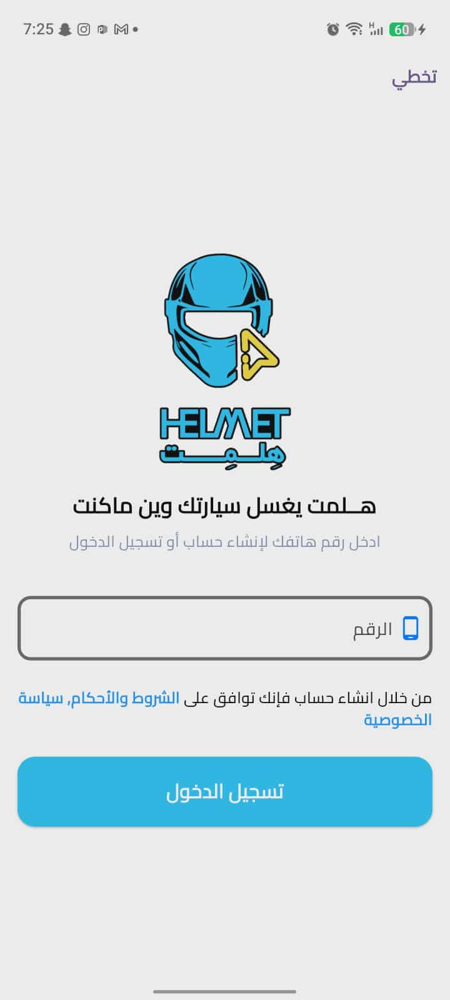

# HELMET - On-Demand Car Wash App 🚗🧼

Helmet is a mobile application that allows users to request car wash services at their location.  
Users can create accounts, add vehicles, choose between subscription packages or one-time washes, select a location on the map, schedule a wash time, and pay online.  
A service provider will arrive to the user’s location and wash the vehicle on-site.

---

## ✨ Features

- 🔐 Phone number authentication (OTP verification)
- 🚗 Add and manage multiple vehicles
- 🗺️ Location picker using Google Maps
- 📦 Subscription packages & one-time wash options
- 📆 Smart scheduling with available time slots
- 📲 Real-time order status updates
- 🎁 Gift a wash to another user
- 💳 Online payments (Card / Apple Pay / STC Pay / Mada)
- 👤 User profile & wash history

---

## 🛠 Tech Stack

| Technology | Usage |
|-----------|--------|
| Flutter | UI & Mobile Development |
| Dart | Main Programming Language |
| Firebase Authentication | Login & OTP |
| Firestore | Users, Orders, Cars, Subscriptions |
| Realtime Database | Driver schedule syncing |
| GetX | State management & Routing |
| Google Maps API | Location selection |

---

## 📱 Screenshots

<p align="center">
  
  
  
</p>

<p align="center">
  
  
  
</p>
<p align="center">
  
  
  
</p>
<p align="center">
  
  

</p>

---

## 🚀 Installation & Run

```bash
git clone https://github.com/MKmasri2002/helmet.git
cd helmet
flutter pub get
flutter run
